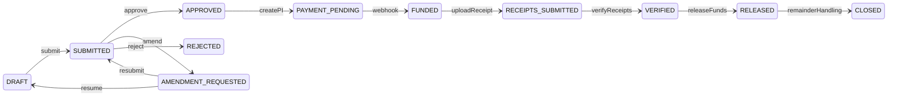

# Parts & Materials (P&M) Sub-Escrow Design

## Overview

P&M is a financial subsystem tied to active jobs. It allows contractors to request reimbursement for materials purchased on behalf of the job poster. All payouts require receipt uploads and approval. P&M uses a **separate escrow bucket** from the main job escrow.

**Non-negotiable rules:**
- P&M is only active when `Job.status === IN_PROGRESS`
- P&M funds cannot exceed approved quote
- Funds cannot be released without receipts
- Stripe PaymentIntent must be idempotent
- All financial moves logged in ledger
- Server-side enforcement only

---

## State Machine

### Allowed Transitions

| From | To |
|------|-----|
| DRAFT | SUBMITTED |
| SUBMITTED | APPROVED, AMENDMENT_REQUESTED, REJECTED |
| AMENDMENT_REQUESTED | DRAFT, SUBMITTED |
| APPROVED | PAYMENT_PENDING |
| PAYMENT_PENDING | FUNDED |
| FUNDED | RECEIPTS_SUBMITTED |
| RECEIPTS_SUBMITTED | VERIFIED |
| VERIFIED | RELEASED |
| RELEASED | CLOSED |
| CLOSED | (terminal) |
| REJECTED | (terminal) |

---

## Escrow Flow

1. **Job Poster approves** P&M request → `approvedTotal` set
2. **Job Poster funds** → `POST create-payment-intent` creates Stripe PI with idempotency key `pm:{pmRequestId}:pi`
3. **Stripe webhook** `payment_intent.succeeded` with `type: pm_escrow`:
   - Create `Escrow` record (kind=PARTS_MATERIALS)
   - Update `PmRequest` (escrowId, status=FUNDED)
   - Write ledger `PM_ESCROW_FUNDED`
4. **Contractor uploads receipts** → status RECEIPTS_SUBMITTED
5. **Job Poster verifies** → status VERIFIED
6. **Job Poster releases** → release from escrow, remainder handling, status CLOSED

---

## Stripe Idempotency

- **create-payment-intent**: If `stripePaymentIntentId` exists, retrieve existing PI and return `clientSecret`. Else create with idempotency key `pm:{pmRequestId}:pi`.
- **Webhook**: Deduplicated via `stripeWebhookEvents` table (event id).
- **Double fund**: Idempotent—second call returns existing clientSecret.

---

## Ledger Transitions

| Type | When |
|------|------|
| PM_ESCROW_FUNDED | Webhook on payment_intent.succeeded (pm_escrow) |
| PM_RELEASE | Release to contractor |
| PM_REFUND | Remainder >= $20 refunded via Stripe |
| PM_CREDIT | Remainder < $20 added to Job Poster wallet |

---

## Edge Case Handling

1. **Receipt total > approvedTotal**: Contractor eats overage. `releaseAmount = MIN(receiptTotal, approvedTotal)`.
2. **Remainder < $20**: Add credit to Job Poster wallet. Close PM.
3. **Remainder >= $20**: Stripe refund. Close PM.
4. **Double release**: Escrow `releasedAt` check; return `alreadyReleased`.
5. **Double PI creation**: Stripe idempotency key; return existing clientSecret.
6. **Job not IN_PROGRESS**: All PM routes reject with 400.

---

## API Routes

Base path: `/api/web/job/[jobId]/pm/`

| Method | Path | Role | Description |
|--------|------|------|-------------|
| GET | / | Contractor or Poster | List PM requests |
| POST | initiate | Contractor | Create DRAFT request |
| POST | add-line-item | Contractor | Add line item (DRAFT/AMENDMENT_REQUESTED) |
| POST | submit | Contractor | Submit for approval |
| POST | approve | Job Poster | Approve request |
| POST | amend | Job Poster | Request amendment |
| POST | reject | Job Poster | Reject request |
| POST | create-payment-intent | Job Poster | Create/retrieve Stripe PI |
| POST | upload-receipt | Contractor | Upload receipt (FUNDED) |
| POST | verify-receipts | Job Poster | Verify receipts (RECEIPTS_SUBMITTED) |
| POST | release-funds | Job Poster | Release to contractor (VERIFIED) |

---

## Database Schema

- **PmRequest**: jobId, contractorId, jobPosterUserId, status, autoTotal, manualTotal, approvedTotal, stripePaymentIntentId, escrowId, etc.
- **PmLineItem**: pmRequestId, description, quantity, unitPrice, lineTotal
- **PmReceipt**: pmRequestId, fileBase64, extractedTotal, verified

Migration: `drizzle/0049_parts_materials.sql`

---

## Production Hardening Guarantees

### Idempotency Strategy

- **Initiate**: backend rejects parallel active requests with `409 PM_REQUEST_ALREADY_ACTIVE`.
- **Create PI**: reuses existing `stripePaymentIntentId`; Stripe idempotency key is deterministic (`pm:{pmRequestId}:pi`).
- **Release funds**: repeat calls after release return idempotent success (`alreadyReleased`).
- **Webhook finalize**: deduped by `stripeWebhookEvents` and resilient to escrow insert races using PI lookup.

### Concurrency Controls

- **Single active request rule** is enforced both:
  - in route pre-check, and
  - in DB via unique partial index on `PmRequest(jobId)` for non-terminal statuses.
- **Single payout per PM request** is enforced via unique index on `ContractorPayout(pmRequestId)`.
- **Escrow duplication protection** uses unique `Escrow.stripePaymentIntentId` plus finalize-time reuse logic.

### Ledger Invariants

- `PM_ESCROW_FUNDED` is written exactly once per escrow (checked before insert).
- `PM_RELEASE` is written inside release transaction.
- `PM_REFUND` is written only after Stripe refund success.
- `PM_CREDIT` is written only when wallet-credit path is used.
- All PM financial writes occur in transactional flow to avoid partial state.

### Overrun Policy

- Release path recalculates receipt totals server-side.
- `payable = min(receiptTotal, approvedQuoteTotal)`.
- Overruns are contractor liability; payout never exceeds approved quote.

### Single-Active-Request Rule

- Only one `PmRequest` per job may exist in non-terminal states:
  - allowed terminal statuses: `RELEASED`, `CLOSED`, `REJECTED`.
  - all other statuses are treated as active and block new initiate.
